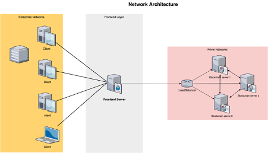
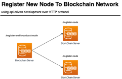
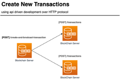
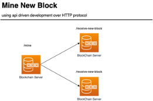
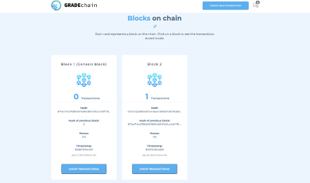

# GradeChain

##  Introduction

The students ’grades in educational institutions are one of the most important assets of the institution. Therefore, the process of maintaining its integrity and safety from hacking is a critical task for specialists in information security. Recently, blockchain technology has raised with the powerful concept that makes it difficult or impossible to change, hack, or cheat the system. In this project we inherited the advantages of blockchain technology to build a distributed system that store student’s grades.

##  Network Architecture

The proposed solution consists of several layers, first layer is the frontend server that responsible for server the frontend application for consumers. The second component is the load balancer that responsible for forwarding the requests from the frontend to just alive blockchain servers, and optimize the response time and avoid unevenly overloading some compute nodes while other compute nodes are left idle. Finally, there are three blockchain application servers that responsible for storing the student's grades using the blockchain concept, and these servers synchronize the data between them over http/https protocol.

##  Application Architecture

We used API driven development (ADD) which enables us to focus on creating applications with APIs. Applications that use APIs were given greater importance and developed to meet customers' needs. Other applications such as user interface, integration points make use of API as their core element. Based on this software architecture we built the communication between blockchain nodes. The following the steps represents the key of synchronization process between nodes.

### Register new nodes to blockchain network:
To register new nodes to our blockchain network to be scalable we defined tow endpoints the first one is a register and broadcast node which it responsible for receiving the IP address and the port of new blockchain server and register it on receiver server this server broadcast this new data to all network server then they use the register node endpoint to register this new instance locally.

### Add new transactions

To create new transaction the frontend application, communicate with a create and broadcast transaction which it responsible for creating the transaction on receiver server and broadcast the transaction to all network server then they create this transaction locally using transactions endpoint over POST method.

### Mine a new block

to mine the transactions into new block the frontend application communicates with /mine endpoint which responsible for mine the new block on receiver server and broadcast the mined block to all network and the other blockchain servers on network and its receive it using /receive-new-block endpoint that responsible for append new block to their chain.

##  DEMO

## API

| EndPoint        | Method           | Prams                        | desc
| ------------- |:-------------:|:--------------------------------:|:------------------------------------------
| /blockchain  |    [get]     |   | returns all data that stored in blockchain
| /transactions/broadcast|   [post]   | |  responsible for create and sign a new transaction and broadcast it for all nodes in the network.
| /transactions  | [post] | | endpoint responsible for receive the broadcast transaction in network and add it to pending transactions.
| /mine |  [get]  | | endpoint responsible for mine the pending transactions and create new block and broadcast it to all nodes in network.
| /receive-new-block | [post] | | responsible for receive the broadcast blocks in network and append it blockchains at each server.
| /consensus | [post] |  | responsible apply longest chain algorithm to ensure the consistency of all nodes. (get all the nodes to agree on one consistent state of the ledger)
| /block/:blockHash | [get] | block hash | returns the block information from blockchain.
| /transactions/:transactionId | [get] | transaction id | returns specific transaction information
| /address/:address | [get] | studentID | returns all transactions for specific student with his GPA

## License

Licensed under the [MIT license](https://opensource.org/licenses/mit-license.php).